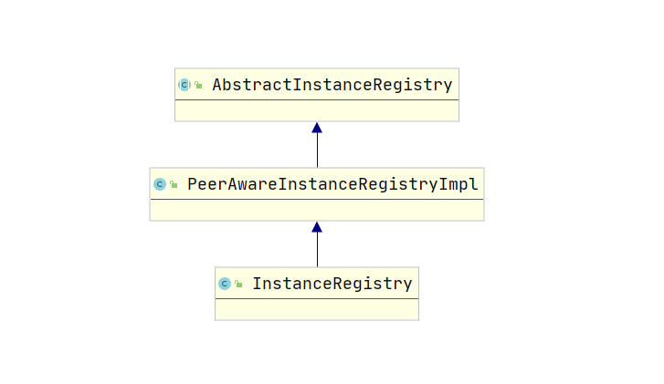

一、引入
```
在上篇文章中, 对自我保护机制的源码进行了分析, 其中涉及到了一个组件是Timer, 这个Timer是java内置的
定时器, 这个组件我没有进行分析, 我在公司的开发中, 涉及到定时任务, 如果不是特殊场景, 我都会用Java
内置的定时器Timer来完成, 这个我不太清楚大家是否有这个类的使用经历, 如果没有的话, 建议可以去尝试用
一下, 因为后面我们可以看到, Eureka里面的定时任务几乎都是Timer来实现的......为了防止在阅读源码的过
程中有盲点, 建议是可以先去了解一下Timer的特性, 我简单的说一下:
    <1> 上一个周期如果没有执行完毕, 不会触发下一个周期的执行, 换句话说, Timer内其实就是用一个单线
        程来完成定时任务的执行的
    <2> Timer执行定时任务时, 需要我们提供一个TimerTask的实现类, 重写里面的run方法, 在run方法中完
        成定时任务业务逻辑
    <3> 一个Timer可以执行多个定时任务, 也就是说可以有多个TimerTask被该Timer执行, 其实里面就是用
        一个队列来存储这些TimerTask, 然后依次执行
    <4> 只要有一个TimerTask发生异常, 那么整个Timer就会被终止, 即其他的TimerTask也会受到影响
```

二、基础组件分析

1、LeaseInfo类属性描述
```java
public class LeaseInfo {
    private int renewalIntervalInSecs;
    private int durationInSecs;

    private long registrationTimestamp;
    private long lastRenewalTimestamp;
    private long evictionTimestamp;
    private long serviceUpTimestamp;
}

LeaseInfo, 翻译成中文就是租聘信息, 分别有六个属性, 下面我们分别来说下这六个属性的意思吧

renewalIntervalInSecs, 服务续约间隔, 这个属性其实存的就是我们在配置文件中配置的
eureka.instance.lease-renewal-interval-in-seconds值, 即表示客户端每隔多少秒向服务端发送心跳包

durationInSecs, 存活时间, 即eureka.instance.lease-expiration-duration-in-seconds的值, 作用是
告诉EurekaServer如果经过durationInSecs时间还没收到我的心跳包, 那么就可以把我当作过期的服务了, 从
而可以从实例列表中剔除掉

以上两个属性其实都是客户端的配置而已, 前者默认为30, 后者默认为90, 即30秒发送一次心跳包, 如果超过90
秒还没收到新的心跳包, 那么就可以剔除我了

registrationTimestamp, 表示客户端注册到服务端的时间
lastRenewalTimestamp, 表示该客户端上一次续约的时间, 或者是上一次收到该客户端心跳包的时间
evictionTimestamp, 表示EurekaServer剔除该服务的时间
serviceUpTimestamp, 表示服务上线的时间
```


2、InstanceInfo类属性描述(只列举了部分)
```java
public class InstanceInfo{
    private volatile String instanceId;
    private volatile String appName;
    private volatile String ipAddr;
    private volatile Long lastUpdatedTimestamp;

    private volatile LeaseInfo leaseInfo;
}

appName, 表示一类服务, 比如购物车服务

instanceId, 就是我们配置的在一类服务中对一个服务的唯一标识, 比如购物车服务配置了两个, 这两个服务的
appName均为CartService, 但是这个购物车服务集群中单独的一个服务会通过instanceId来进行唯一标识

ipAddr, 该服务的IP地址

lastUpdatedTimestamp, 上次更新时间, 当我们进行服务续约的时候, 这个时间就会更新

leaseInfo, 服务的续约信息
```


3、服务注册的原理简析
```java
看完上面两个类的定义, 大家可能会有点懵, 不清楚是用来干嘛的, 我们先来简单说说服务注册的原理吧, 
EurekaServer会在内存中定义一个类似于如下的数据结构(记住, 是类似):
    Map<appName, Map<InstanceId, InstanceInfo>>
假设我们有两类服务, 一类是购物车服务, 一类是订单服务, 每个服务分别搭建了两台实例构成了集群, 当这些
服务注册到EurekaServer的时候, 就会在这个Map中保存这四台实例的信息, Map的第一层有两个key, 分别为
购物车服务和订单服务, 而每个key又对应了一个嵌套的Map, 这个嵌套的Map就保存了该类型服务的两个实例

上述是服务端存储服务的数据结构, 那么客户端如何向EurekaServer注册服务呢?就是通过HTTP协议, 
像我们平时做web开发一样, EurekaServer也定义了一个接口, 翻译成我们SpringMVC开发可以如下表示:

@RequestMapping( "/addInstance" )
public Response addInstance(InstanceInfo info, String isReplication) {
    ..............添加服务..............
}

客户端只需要将调用该接口, 然后传入对应的参数就可以注册服务到EurekaServer了, 所以InstanceInfo的作
用就清楚了, 用于表示一个服务的信息, 通常情况下, 一个客户端注册服务到EurekaServer是不用传全部的参数
的, 举个例子, InstanceInfo中的lastUpdatedTimestamp, 通常客户端是没有的, 所以传的是少部分参数, 
客户端通过封装成一个InstanceInfo的json数据, 然后调用EurekaServer的注册接口, 将自身注册上去, 而
EurekaServer就直接将这个InstanceInfo保存到Map中的, 之后这个节点进行服务续约, 服务下线的时候, 就
可以更改InstanceInfo中对应的时间字段

在上面的描述中, 我们了解到了以下几个信息:
    <1> 表示一个服务节点信息是通过InstanceInfo来表示的
    <2> 客户端往EurekaServer注册信息其实就是构造一个InstanceInfo类型的json数据
    <3> EurekaServer用一个两层的Map来保存注册的服务信息, 第一层用来区分不同类型的服务, 第二层用来
        区分相同类型服务中的不同实例
    <4> 客户端通过HTTP协议与EurekaServer进行数据的交互
    <5> isReplication这个字段我们先不说, 跟集群同步有关, 之后我们分析集群同步的时候再来说这个字段

到了这里, 想必大家对服务注册有了一个基本的认识, 然而在EurekaServer中保存服务实例的Map并不是我上面
声明的那样, 而是: ConcurrentHashMap<String, Map<String, Lease<InstanceInfo>>>

与我上面声明的不一样的地方就在于, InstanceInfo是被Lease这个对象包裹着的, 于是我们再来看看这个对象
的结构与作用吧:
    public class Lease<T> {
        private T holder;
        private long evictionTimestamp;
        private long registrationTimestamp;
        private long serviceUpTimestamp;
        private volatile long lastUpdateTimestamp;
        private long duration;

        renew();
        cancel();
        serviceUp();
        isExpired();
    }      

根据javadoc的翻译: 描述泛型T代表的对象基于时间的可用性

可以看到, 这个泛型为InstanceInfo的时候, 描述的就是InstanceInfo的可用性了, 什么是可用性呢, 就是
对其进行续约, 下线, 上线等操作的封装, 以及判断是否过期, 这上面的几个时间字段, 其实就是InstanceInfo
中LeaseInfo的字段的值, 两者是一样的, 可以认为, Lease这个对象其实和InstanceInfo本身没有太多联系,
InstanceInfo描述的是服务节点的信息, Lease描述的是泛型T对应的对象的租聘信息, 即是否过期, 以及续约
等, 之所以用泛型, 是因为, 这个Lease类还可以描述其他对象的租聘信息, 比如我们可以定义一个Person类,
然后Lease<Person>就是表示对Person类对象的租聘信息......
```


4、小小的总结
```
通过上面的三小节, 我们认识了以下几个类, Lease、InstanceInfo、LeaseInfo, 了解到了一个服务节点在
EurekaServer中的存储结构: ConcurrentHashMap<String, Map<String, Lease<InstanceInfo>>>, 同时
明白了客户端与EurekaServer是通过HTTP进行信息交互的

但是!EurekaSerer本身不是通过SpringMVC这个框架来定义接口的, 而是利用另外的一个框架, 即Jersey, 这
个框架也是一个Web开发框架, 简单的说下两者的区别吧, SpringMVC通过Java原生的Servlet体系来实现的接口
交互, 所有的请求都被打到了DispatcherServlet中, 由DispatherServlet进行请求的分发, 即SpringMVC通
过继承原始Servlet来完成的请求处理, 而Jersey则是利用Filter来完成, 即过滤器, 这就是两者的区别, 你可
以理解为, Jersey定义了一个XXXXFilter, 然后将其注入到tomcat等web容器中, 进而完成请求的分发与处理

如果大家有兴趣可以去了解下Jersey这个框架, 与SpringMVC一样都是web开发框架, 熟悉了SpringMVC的话, 
想必Jersey理解起来会非常的轻松, 技术就是这样, 都是相通的

于是, 我们之后就可以来看看EurekaSever是怎么来实现这个添加节点 / 服务注册的业务逻辑了
```


三、EurekaServer接口处理业务继承关系分析
```java
在真正分析EurekaServer服务注册源码之前, 我们有必要对源码中继承关系有一个清晰的了解, 如下图所示,
简单的三层继承体系, 就是EurekaServer处理注册信息的架构了, 先来说说AbstractInstanceRegistry吧,

根据javaDoc的翻译: 处理来自Eureka客户端的所有对注册表的请求, 执行的主要操作是注册, 续订, 取消, 到
期和状态更改, 注册表还存储了增量操作

注册表就是我们上面说的那个双层的Map, 即存储注册信息的数据结构, 可以认为, 客户端的注册续订, 取消,
到期和状态更改的操作都是在这个类完成的, 而那个双层的Map也是在这个类中的, 还有一个是存储了增量操作,
这个增量操作我们放在服务发现那一篇文章来分析, 这里大家先不用理会, 先来看看这个类的伪代码吧

public abstract class AbstractInstanceRegistry {
    private ConcurrentHashMap<String, Map<String, Lease<InstanceInfo>>> registry
            = new ConcurrentHashMap<String, Map<String, Lease<InstanceInfo>>>();

    private final MeasuredRate renewsLastMin;

    public void register () { .....服务注册..... }

    public void cancel () { .....服务下线..... }

    public void renew () { .....服务续约..... }

    public void evit () { .....服务剔除..... }
}

换句话说, 我们对这些操作的分析, 其实就是对这四个方法的源码进行分析而已!!!!, renewsLastMin大家是不
是觉得很熟悉, 就是我们上一篇文章----自我保护机制源码 中提到的那个计数器, 每次renew方法的调用都会
调用这个计数器的increment方法


AbstractInstanceRegistry类实现了所有的客户端对注册表的请求操作, 然而还有一个操作没有说到, 那就是
集群同步, 集群同步的原理其实也很简单, 我们先来简单了解下, 现在有EurekaServer1和EurekaServer2构成
一个EurekaServer集群, 当客户端注册到EurekaServer1的时候, EurekaServer1会执行上面那个register方
法, 随后EurekaServer1以自身当成客户端, 往EurekaServer2发送一个注册请求, 注册请求的InstanceInfo
就是EurekaServer1接收到的InstanceInfo, 为了扩展这个集群同步的功能, 于是就有了下图中处于第二层的
PeerAwareInstanceRegistryImpl这个类了, 我们用伪代码来看看这个类是怎么定义的吧

public class PeerAwareInstanceRegistryImpl extends AbstractInstanceRegistry {
    public void register () { 
        super.register();
        replicateToPeers();
     }

    public void cancel () {
        super.cancel();
        replicateToPeers();
    }

    public void renew () {
        super.renew();
        replicateToPeers();
    }
}

很清晰, 先调用父类的对应的各个方法, 然后调用完成后进行集群同步, 所以真正的服务注册、服务续约、服务
下线都是交给父类的, PeerAwareInstanceRegistryImpl仅仅增加了集群同步的功能而已(服务剔除不是一个客
户端的主动调用操作, 而是EurekaSever本身的机制, 所以子类不会重写这个方法)

以上两个类都是Eureka源码本身的, 由于我们是SprigCloud整合的Eureka, 在Spring中, 有一个非常有用的
机制---监听器机制, 关于Spring监听器机制, 我也专门写过一篇文章来分析, 大家有兴趣可以去前面的Spring
源码系列看看, SpringCloud整合了Eureka后, 期望在这些服务注册、服务续约等等操作之前增加一个通知的功
能, 于是下图中最后一层InstanceRegistry类就出现了, 我们先来看看这个类的伪代码吧:
public class InstanceRegistry extends PeerAwareInstanceRegistryImpl {
    public void register() {
		publishRegisterEvent();
		super.register();
	}

    public boolean cancel() {
		publishCancelEvent();
		super.register();
	}

    public boolean renew() {
		publishRenewEvent();
		super.renew();
	}
}

可以看到, 实际的服务注册等功能还是交给父类来完成的, InstanceRegistry只是在这些功能被触发之前发布了
相关的事件而已, 而作为开发者的我们如果期望在这些操作之前做一些事情, 比如说发送邮件、输出日志, 就可
以通过实现一个对应的监听器来完成


总结: 
    AbstractInstanceRegistry：完成服务注册、服务续约等功能
    PeerAwareInstanceRegistryImpl: 增加了集群同步功能
    InstanceRegistry: 增加了监听器机制

三个类构成继承关系, 也是一个典型的责任链模式!!!!所以我们之后分析服务注册等功能都是针对于
AbstractInstanceRegistry这个类的源码进行分析的, 接下来我们要分析的服务注册的源码, 其实就是对
AbstractInstanceRegistry这个类的
```




四、服务注册register方法源码分析
```java
public void register(InstanceInfo registrant, int leaseDuration, boolean isReplication) {
    Map<String, Lease<InstanceInfo>> gMap = registry.get(registrant.getAppName());
    if (gMap == null) {
        final ConcurrentHashMap<String, Lease<InstanceInfo>> gNewMap = new ConcurrentHashMap<String, Lease<InstanceInfo>>();
        gMap = registry.putIfAbsent(registrant.getAppName(), gNewMap);
        if (gMap == null) {
            gMap = gNewMap;
        }
    }
    ..........................
}

先来看看第一段代码, registry就是我们之前说的那个双层的Map了, 即注册表, registrant.getAppName方
法就是获取服务名, 比如订单服务OrderService, 一个订单服务可能是有多个实例构成集群的, 然后利用这个
服务名从registry中获取第二层的Map, 如果这个Map不存在, 那么就创建一个, 并且把它放到registry中, 所
以这第一段代码其实就是获取或者创建第二层Map而已


public void register(InstanceInfo registrant, int leaseDuration, boolean isReplication) {
    ..........................
    Lease<InstanceInfo> existingLease = gMap.get(registrant.getId());
    if (existingLease != null && (existingLease.getHolder() != null)) {
        Long existingLastDirtyTimestamp = existingLease.getHolder().getLastDirtyTimestamp();
        Long registrationLastDirtyTimestamp = registrant.getLastDirtyTimestamp();

        if (existingLastDirtyTimestamp > registrationLastDirtyTimestamp) {
            registrant = existingLease.getHolder();
        }
    } else {
        synchronized (lock) {
            if (this.expectedNumberOfClientsSendingRenews > 0) {
                this.expectedNumberOfClientsSendingRenews = this.expectedNumberOfClientsSendingRenews + 1;
                updateRenewsPerMinThreshold();
            }
        }
    }
    ..........................
}

再来看看第二段代码, 从第二层Map中获取注册的实例, 虽然当前方法是一个注册接口, 但是可能会被多次调用,
比如说手动调用注册接口, 或者客户端非法下线(强杀进程), 然后再启动后也会调用这个注册接口, 这样就是多
次调用了, 而这第二段代码就有处理这个多次调用的问题

lastDirtyTimestamp直接翻译可能不太好理解, 上一次肮脏的时间.....但是我们来看看其javadoc的翻译就会
明白这个字段什么作用了: 获取触摸此实例时的最后一个时间戳

其实就是最近一次去更新这个实例信息的时间, 当existingLease不为空, 并且实例也不为空的时候, 说明之前
就注册过了, 此时对之前注册的和本次注册lastDirtyTimestamp进行对比, 如果之前的lastDirtyTimestamp
大于当前调用注册接口的lastDirtyTimestamp, 则说明存在于注册表中的实例信息比当前的实例信息还要更加
新, 此时就将InstanceInfo替换为已经存在于注册表中的实例信息, 反之则不进行替换

如果之前没有注册过, 那么就进入else判断, 这个时候我们就看到了expectedNumberOfClientsSendingRenews
参数了, 回想其上一篇文章对这个参数的分析, 期望发送心跳包的客户端个数, 其实就是指有几个客户端注册上
来了, 由于是新注册的, 所以要让这个值加1, 随后更新续约阈值, 这一段代码在上一篇文章已经详细分析过了


public void register(InstanceInfo registrant, int leaseDuration, boolean isReplication) {
    ..........................
    Lease<InstanceInfo> lease = new Lease<InstanceInfo>(registrant, leaseDuration);
    if (existingLease != null) {
        lease.setServiceUpTimestamp(existingLease.getServiceUpTimestamp());
    }
    gMap.put(registrant.getId(), lease);
    ..........................
}
第三段代码其实就是将新注册的实例信息保存到注册表中而已, 这里会创建一个新的Lease对象, 将InstanceInfo
包装进去, 如果existingLease不为空, 说明之前就存在了, 此时要将这个serviceUpTimestamp设置为已经存
在于注册表中的实例的该字段值, 这个字段表示实例上线的时间, 在这里等于服务注册的时间, 最后将其放入到
第二层Map中

public void register(InstanceInfo registrant, int leaseDuration, boolean isReplication) {
    ..........................
    if (InstanceStatus.UP.equals(registrant.getStatus())) {
        lease.serviceUp();
    }
    registrant.setActionType(ActionType.ADDED);
    registrant.setLastUpdatedTimestamp();
    invalidateCache(registrant.getAppName(), registrant.getVIPAddress(), registrant.getSecureVipAddress());
    ..........................
}
如果服务注册的状态是UP, 则将其ServiceUpTimestamp设置为当前时间(lease.serviceUp), 状态更新了解一
下就好, 其次, ActionType的设置就比较重要了, 设置当前这个InstanceInfo的操作类型, 这个操作类型用于
集群同步的, 我们可以想象一个场景, 有一个switch....case语句, 根据InstanceInfo的ActionType来决定
向其他EurekaServer发送集群同步的操作是[注册、续约、下线]中的哪一个, 这个就是ActionType的作用, 这
里表示是注册操作

registrant.setLastUpdatedTimestamp() -> 设置最近一次更新时间为当前时间

invalidateCache使得缓存失效, 涉及到缓存的内容, 我们放到服务发现章节来进行分析, 这里简单的说下, 服
务端会对注册信息进行缓存, 这样客户端拉取注册信息的时候可以走缓存, 缓存的作用通常是用来解决高并发情
况下的读写冲突等情况的, 当一个服务注册到EurekaServer的时候, 必然要使缓存失效, 这样之后的服务发现操
作才能不再通过缓存, 否则不能取到最新的信息
```

五、总结
```
第一部分, 我们有以下几个收获:
    <1> Lease、InstanceInfo、LeaseInfo是实例的表现形式
    <2> Eureka客户端通过HTTP来与EurekaServer进行交互
    <3> EurekaServer通过一个双层的Map来存储注册信息
            ConcurrentHashMap<String, Map<String, Lease<InstanceInfo>>>

第二部分, 我们引入了EurekaServer中对节点操作的类的处理模式 ----> 责任链模式, 最底层是SpringCloud
组件实现的InstanceRegistry, 提供了事件机制, 上一层是PeerAwareInstanceRegistryImpl, 提供了集群
同步的功能, 最上层是AbstractInstanceRegistry, 所有的操作都在AbstractInstanceRegistry中完成

第三部分, 我们对AbstractInstanceRegistry中register方法进行了分析, 主要有以下几个操作:
    <1> 根据AppName获取第二层的Map, 如果没有则创建
    <2> 根据实例Id从第二层的Map中获取实例信息, 如果有则更新上一次触摸该实例的时间为当前时间, 如果
        没有则使得expectedNumberOfClientsSendingRenews值加1, 继而更新续约的阈值(用于自我保护机
        制是否启动的判断)
    <3> 创建一个新的Lease并放入到第二层的Map中
    <4> 更新状态时间信息
    <5> 清空缓存(使得缓存失效)

其中, 我们余留了三个问题没有解决:
    <1> isReplication字段的作用, 放在集群同步一章节进行分析
    <2> 在整个源码分析中, 没有涉及到recentlyChangedQueue这个数据的分析, 这个放在服务发现一章节进
        行分析(涉及到全量拉取和增量拉取的原理)
    <3> invalidateCache对缓存失效的原理(放在服务发现一章节进行分析)
```
