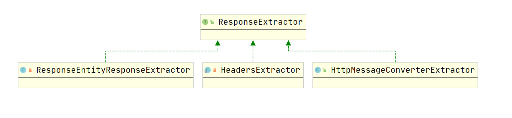
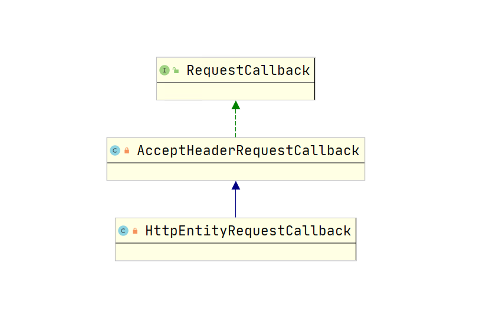
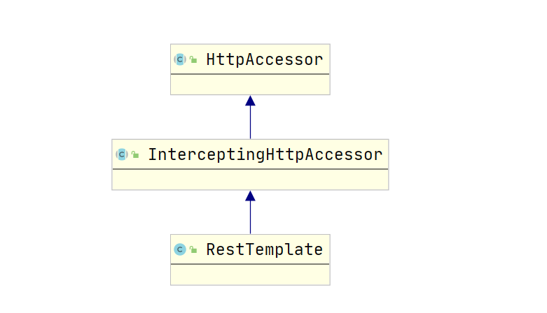

一、引入RestTemplate
```java
public RestTemplate {
    public <T> ResponseEntity<T> exchange(
                            RequestEntity<?> requestEntity, Class<T> responseType) {

		RequestCallback requestCallback = httpEntityCallback(requestEntity, responseType);
		ResponseExtractor<ResponseEntity<T>> responseExtractor = responseEntityExtractor(responseType);
		return doExecute(requestEntity.getUrl(), 
                        requestEntity.getMethod(), requestCallback, responseExtractor);
	}

    public <T> T execute(URI url, HttpMethod method, RequestCallback requestCallback,
			ResponseExtractor<T> responseExtractor){
		return doExecute(url, method, requestCallback, responseExtractor);
	}
} 

分析: RestTemplate主要就这两类方法, exchangee和execute, 可以看到, 在exchange方法中会定义
RequestCallback和ResponseExtractor, 而execute则是通过参数的方式将这两个类型的对象传入, 可以理
解为, exchange交换, 传递一个请求数据, 获取一个返回的数据, 而真正的操作在doExecute方法中完成, 
execute方法扩展出来使得能够自定义RequestCallback和ResponseExtractor, 本篇文章会对
RequestCallback、ResponseExtractor、RestTemplate的体系结构, doExecute方法进行分析
```

二、ResponseExtractor
```java
ResponseExtractor简单的翻译为响应数据的提取器, 因为我们从服务端拿到的数据是一个二进制的流, 或者
从Http层面上来说, 就是一个响应体, 通常情况下, 我们会返回一个JSON数据给调用端, 当我们使用
RestTemplate的时候, 我们就是调用端, 将服务器返回的数据(字符串)需要解析为我们期望的对象, 就需要
用到这个提取器了, 举个简单的例子, 我期望将该JSON数据反序列化为Person对象, 那么在上面调用
exchange方法的时候, ResponseEntity中的泛型就可以定义为Person, 当拿到响应数据的时候, 就会利用
这个提取器将其反序列化为Person对象, 这个反序列化的方式可以为jackson

而这个提取器其实就是一系列的HttpMessageConverter, 如果对SpringMVC的源码有所了解的话, 就会想到
其实在SpringMVC中, 对于响应给调用端的数据的序列化就是利用HttpMessageConverter来完成的, 举个简
单的例子, 如果期望返回的数据是json, 则利用的是MappingJackson2HttpMessageConverter, 如果期望返
回的数据为xml则利用的是MappingJackson2XmlHttpMessageConverter, 而在RestTemplate中的提取器也
是这样的

提取器的原理是, 利用一个List来保存所有的HttpMessageConverter, 这个类有主要有四个方法:
public interface HttpMessageConverter<T> {
	boolean canRead(Class<?> clazz, @Nullable MediaType mediaType);

	boolean canWrite(Class<?> clazz, @Nullable MediaType mediaType);
    
    List<MediaType> getSupportedMediaTypes();

	T read(Class<? extends T> clazz, HttpInputMessage inputMessage)
			throws IOException, HttpMessageNotReadableException;

	void write(T t, @Nullable MediaType contentType, HttpOutputMessage outputMessage)
			throws IOException, HttpMessageNotWritableException;
}

HttpMessageConverter的作用是将对象与二进制数据进行转换, 或者说是序列化与反序列化, 举个例子, 
canRead方法表示, 能否将Http消息反序列化成clazz对应的类型对象, canWrite则表示, 能否将clazz对应
的对象序列化为http消息并发送, 如果返回true, 则调用对应的read或者write方法进行操作

public class HttpMessageConverterExtractor<T> implements ResponseExtractor<T> {
    private final Class<T> responseClass;

	private final List<HttpMessageConverter<?>> messageConverters;

    public T extractData(ClientHttpResponse response){
        .........................
    }
}

可以看到, HttpMessageConverterExtractor里面就是内置了多个HttpMessageConverter构成的List, 通
过extractData来将响应的数据转为泛型T类型, 这个泛型T就是我们定义的用于接收响应体的类型

private class ResponseEntityResponseExtractor<T> implements ResponseExtractor<ResponseEntity<T>> {
    private final HttpMessageConverterExtractor<T> delegate;

    public ResponseEntityResponseExtractor(@Nullable Type responseType) {
        if (responseType != null && Void.class != responseType) {
            this.delegate = new HttpMessageConverterExtractor<>(responseType, getMessageConverters(), logger);
        }
        else {
            this.delegate = null;
        }
    }

    @Override
    public ResponseEntity<T> extractData(ClientHttpResponse response) throws IOException {
        if (this.delegate != null) {
            T body = this.delegate.extractData(response);
            return ResponseEntity.status(
                response.getRawStatusCode()).headers(response.getHeaders()).body(body);
        }
        else {
            return ResponseEntity.status(
                response.getRawStatusCode()).headers(response.getHeaders()).build();
        }
    }
}

ResponseEntityResponseExtractor的源码很简单, 如果我们提供的返回类型不为空并且不是Void的话, 则
delegate这个委派对象就是HttpMessageConverterExtractor, 否则就是null, 也能很好理解, 如果我们期
望服务端返回的数据转为指定类型, 那么就会委派为HttpMessageConverterExtractor来进行数据的提取,
再去看看ResponseEntityResponseExtractor的extractData方法就会非常明白了
```



三、RequestCallback
```java
RequestCallback和ResponseExtractor也有共同之处, 当请求体的数据不为空的时候, 就会利用
HttpMessageConverter来将这些数据进行序列化并发送给服务端, 其继承体系就两层, 如下图所示, 第一层
是AcceptHeaderRequestCallback, 里面做的事情很简单, 就是遍历所有的HttpMessageConverter, 如果
这个HttpMessageConverter能够将数据解析为我们定义的返回值接收类型, 那么就会在Accept这个请求头中
就会设置对应的MediaType

第二层是HttpEntityRequestCallback, 作用也很简单, 如果我们有定义请求体, 比如post请求, 我们定义
了请求体的类型为application/json, 那么就会将我们在RequestEntity中设置的对象转为json并发送到
服务端, 而将对象转为JSON就是利用HttpMessageConverter, 所以在这个RequestCallBack中就可以看到遍
历一个个的HttpMessageConverter, 如果canWrite方法返回true, 则调用write方法将对象数据转为对应的
http数据发送到服务端
```



四、doExecute方法源码分析
```java
protected <T> T doExecute(URI url, HttpMethod method, RequestCallback requestCallback,
			ResponseExtractor<T> responseExtractor) {
    ClientHttpResponse response = null;
    ClientHttpRequest request = createRequest(url, method);
    if (requestCallback != null) {
        requestCallback.doWithRequest(request);
    }
    response = request.execute();
    handleResponse(url, method, response);
    return (responseExtractor != null ? responseExtractor.extractData(response) : null);
}

doExecute方法就几行代码, 首先是通过createRequest拿到一个ClientHttpRequest对象, 利用这个对象的
execute方法发送请求, 可以看到, 如果requestCallback不为空, 就调用doWithRequest方法, 这个方法的
作用在上面我们有提到过, 由于有两层继承关系, 先是调用了AcceptHeaderRequestCallback对象来设置
Accept请求头, 然后调用HttpEntityRequestCallback对象对应的方法, 判断是否存在请求体, 如果存在则
利用HttpMessageConverter将请求体对象转为二进制数据发送到服务端, 这就是RequestCallBack的作用

handleResponse里面是对error异常的处理, 可以略过.............

最后, 如果有响应体, 则利用ResponseExtractor来遍历一个个的HttpMessageConverter并找到合适的
(canRead方法返回true的), 进而将响应的数据反序列化为对应的对象并返回

createRequest方法和通过该方法获取到的ClientHttpRequest中的execute方法是本篇文章的重点, 也是
Ribbon + Eureka实现负载均衡的入口, 我们接下来开始详细的分析
```

五、RestTemplate体系结构分析
```java
如下图所示, 就是RestTempalte的继承体系了, 最上层是HttpAccessor:
public abstract class HttpAccessor {
	private ClientHttpRequestFactory requestFactory = new SimpleClientHttpRequestFactory();

	public void setRequestFactory(ClientHttpRequestFactory requestFactory) {
		this.requestFactory = requestFactory;
	}

	public ClientHttpRequestFactory getRequestFactory() {
		return this.requestFactory;
	}

	protected ClientHttpRequest createRequest(URI url, HttpMethod method) throws IOException {
		ClientHttpRequest request = getRequestFactory().createRequest(url, method);
		return request;
	}
}

分析:
    可以看到, HttpAccessor的源码其实很简单, 就是直接定义了一个默认的ClientHttpRequestFactory,
    其类型是SimpleClientHttpRequestFactory, 顾名思义, 就是创建ClientHttpRequest对象的工厂,
    对于requestFactory提供了一个get和set方法, 而createRequest就是获取到这个RequestFactory并
    调用其createRequest方法

public abstract class InterceptingHttpAccessor extends HttpAccessor {
	private final List<ClientHttpRequestInterceptor> interceptors = new ArrayList<>();

	@Nullable
	private volatile ClientHttpRequestFactory interceptingRequestFactory;

	public void setInterceptors(List<ClientHttpRequestInterceptor> interceptors) {
		if (this.interceptors != interceptors) {
			this.interceptors.clear();
			this.interceptors.addAll(interceptors);
			AnnotationAwareOrderComparator.sort(this.interceptors);
		}
	}

	public List<ClientHttpRequestInterceptor> getInterceptors() {
		return this.interceptors;
	}

	@Override
	public ClientHttpRequestFactory getRequestFactory() {
		List<ClientHttpRequestInterceptor> interceptors = getInterceptors();
		if (!CollectionUtils.isEmpty(interceptors)) {
			ClientHttpRequestFactory factory = this.interceptingRequestFactory;
			if (factory == null) {
				factory = new InterceptingClientHttpRequestFactory(super.getRequestFactory(), interceptors);
				this.interceptingRequestFactory = factory;
			}
			return factory;
		}
		else {
			return super.getRequestFactory();
		}
	}
}

HttpAccessor的直接子类InterceptingHttpAccessor的源码也很简单, 定义了一个List, 存储的是一个个
的ClientHttpRequestInterceptor, 再getRequestFactory中, 如果这个list不为空, 则返回的是
InterceptingClientHttpRequestFactory, 否则返回的是super.getRequestFactory(), 即在
HttpAccessor中定义的SimpleClientHttpRequestFactory, 而InterceptingClientHttpRequestFactory
中又持有一个HttpAccessor中定义的SimpleClientHttpRequestFactory的引用

在上面对getRequestFactory的分析中, 我们可以得出一个结论, 当调用RestTemplate的createRequest方
法的时候, 其实调用的就是HttpAccessor的createRequest方法, 在该方法中会先获取到RequestFactory, 
然后调用RequestFactory的createRequest方法, 当存在ClientHttpRequestInterceptor的时候, 调用的
是InterceptingClientHttpRequestFactory的createRequest方法, 否则调用的是
SimpleClientHttpRequestFactory的createRequest方法
```



六、createRequest方法获取ClientHttpRequest对象

1、SimpleClientHttpRequestFactory的createRequest方法
```java
public class SimpleClientHttpRequestFactory {
    public ClientHttpRequest createRequest(URI uri, HttpMethod httpMethod) {
        HttpURLConnection connection = openConnection(uri.toURL(), this.proxy);
        prepareConnection(connection, httpMethod.name());

        if (this.bufferRequestBody) {
            return new SimpleBufferingClientHttpRequest(
                    connection, this.outputStreaming);
        }
        else {
            return new SimpleStreamingClientHttpRequest(
                connection, this.chunkSize, this.outputStreaming);
        }
    }    
}

根据一定的条件创建SimpleBufferingClientHttpRequest和SimpleStreamingClientHttpRequest, 后者是
基于流的Http客户端, 前者则提供了buffer缓冲区, 有兴趣的同学可以深入了解下HttpURLConnection发送
请求的原理
```

2、InterceptingClientHttpRequestFactory的createRequest方法
```java
protected ClientHttpRequest createRequest(
            URI uri, HttpMethod httpMethod, ClientHttpRequestFactory requestFactory) {
    return new InterceptingClientHttpRequest(
            requestFactory, this.interceptors, uri, httpMethod);
}

就是创建了一个InterceptingClientHttpRequest
```

3、小小的总结
```
如果存在ClientHttpRequestInterceptor, 则createRequest方法创建的是
InterceptingClientHttpRequest, 如果不存在则创建的SimpleBufferingClientHttpRequest或者
SimpleStreamingClientHttpRequest, 通常是SimpleStreamingClientHttpRequest, 进而发送请求, 即
调用execute方法进行请求的发送, 其实InterceptingClientHttpRequest最后也是通过后面这两个类型的
ClientHttpRequest对象进行请求的发送的, 可以看到, 创建InterceptingClientHttpRequest的时候将
requestFactory传入了进去, 而这个requestFactory就是SimpleClientHttpRequestFactory, 同时将所有
的ClientHttpRequestInterceptor传入了进去, 下面我们来分析InterceptingClientHttpRequest的
createRequest方法
```

七、InterceptingClientHttpRequest的createRequest方法
```java
protected final ClientHttpResponse executeInternal(HttpHeaders headers, byte[] bufferedOutput) throws IOException {
    InterceptingRequestExecution requestExecution = new InterceptingRequestExecution();
    return requestExecution.execute(this, bufferedOutput);
}

创建了一个InterceptingRequestExecution, 并调用其execute方法

private class InterceptingRequestExecution implements ClientHttpRequestExecution {
    private final Iterator<ClientHttpRequestInterceptor> iterator;

    public InterceptingRequestExecution() {
        this.iterator = interceptors.iterator();
    }

    @Override
    public ClientHttpResponse execute(HttpRequest request, byte[] body) throws IOException {
        if (this.iterator.hasNext()) {
            ClientHttpRequestInterceptor nextInterceptor = this.iterator.next();
            return nextInterceptor.intercept(request, body, this);
        }
        else {
            HttpMethod method = request.getMethod();
            ClientHttpRequest delegate = requestFactory.createRequest(request.getURI(), method);
            request.getHeaders().forEach((key, value) -> delegate.getHeaders().addAll(key, value));
            if (body.length > 0) {
                if (delegate instanceof StreamingHttpOutputMessage) {
                    StreamingHttpOutputMessage streamingOutputMessage = (StreamingHttpOutputMessage) delegate;
                    streamingOutputMessage.setBody(outputStream -> StreamUtils.copy(body, outputStream));
                }
                else {
                    StreamUtils.copy(body, delegate.getBody());
                }
            }
            return delegate.execute();
        }
    }
}

我们来看看InterceptingRequestExecution的execute方法, 如果iterator.hasNext返回true, 则调用拦
截器的intercept方法, 如果没有了, 则走else, 在else中其实就是利用SimpleClientHttpRequestFactory
的createRequest方法创建一个ClientHttpRequest对象, 进而发送请求

可以看到, 如果存在拦截器, 那么就会取拦截器的返回值并进行返回了, 如果不存在就走else, 所以我们可以
在拦截器中实现发送请求的功能, 如果不想实现发送请求功能, 仅仅想增加一些额外的功能, 那么可以看到
intercept方法是传了一个this的, 即传入了InterceptingRequestExecution, 那么我们在intercept方法
增加了我们需要的功能的时候, 就可以调用this这个对象的execute方法来将发送请求的功能交给
InterceptingRequestExecution来完成(责任链模式了解一下...........)
```

八、总结
```
RestTemplate最终通过doExecute方法来完成请求的发送, 其中ResponseExtractor负责将返回的数据提取
成我们期望的类型, 原理是利用HttpMessageConverter, 而RequestCallback负责设置Accept请求头, 以及
当请求体存在数据的时候, 利用HttpMessageConverter将对象转为Http对应的数据发送到服务端

先利用ClientHttpRequestFactory的createRequest方法来创建一个ClientHttpRequest对象, 进而调用该
对象的execute方法, 当存在拦截器并且拦截器中没有实现发送请求功能的时候, 代码的执行逻辑是这样的:
    <1> 创建InterceptingClientHttpRequestFactory并调用器createRequest方法, 该方法返回一个
        InterceptingClientHttpRequest对象
    <2> 调用InterceptingClientHttpRequest的execute方法, 其实就是创建一个
        InterceptingRequestExecution, 并调用InterceptingRequestExecution的execute方法
    <3> 调用所有的拦截器的intercept方法, 最后走到InterceptingRequestExecution的execute方法的
        else逻辑
    <4> 利用SimpleClientHttpRequestFactory的createRequest方法创建一个
        SimpleStreamingClientHttpRequest对象, 发送请求
```
