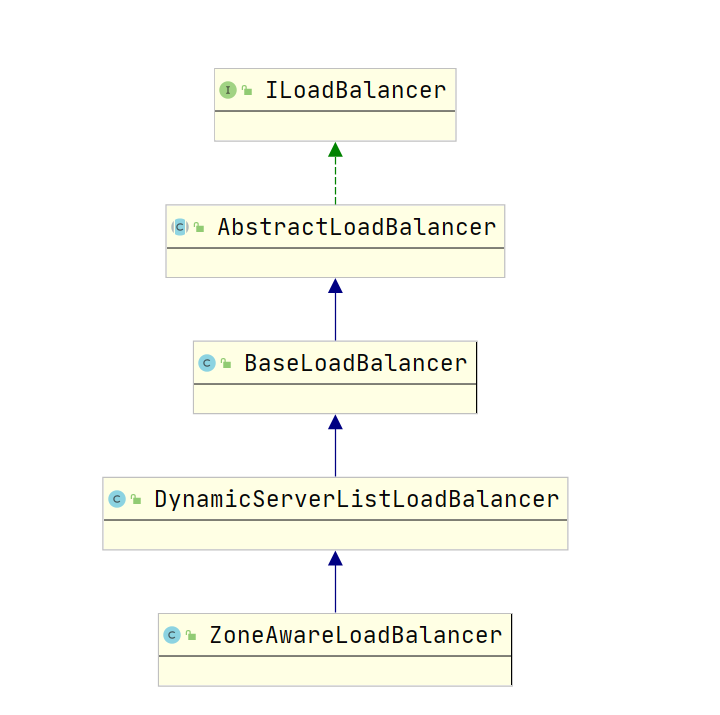

一、引入
```java
本节我们主要分析的是负载均衡器这个组件的源码, 在本篇文章之后, 则会将之前的RestTemplate和本篇文
章的内容结合起来, 从而得出RestTemplate利用Ribbon整合Eureka实现负载均衡的原理
```

二、ILoadBalancer继承体系及接口方法作用分析

1、ILoadBalancer接口分析
```java
在Ribbon中的LoadBalancer, 实现了一套完整的负载均衡功能, 利用一个List来保存所有的服务, 利用
IRule接口来定义从服务列表中以一定的规则获取服务的功能, 在此之后, 还增加了IPing接口来完成对服务
是否存活的判断, 首先来看看ILoadBalancer接口:
public interface ILoadBalancer {
	public void addServers(List<Server> newServers);
	public Server chooseServer(Object key);
	public void markServerDown(Server server);
	public List<Server> getServerList(boolean availableOnly);
    public List<Server> getReachableServers();
	public List<Server> getAllServers();
}

在上面我们说到, 默认情况下所有的服务都放在一个List中, addServers方法作用就是往这个List中添加服
务, 于是我们看到了Server这个类, 其实很简单, 就是对一个服务的定义, 比如保存了host, port:
public class Server {
    private int port;
    private String scheme;
    private String host;
}

chooseServer方法的功能就是从List中选择一个合适的Server并返回, 方法的参数key是用于筛选Server的
一种hint(可以理解为扩展), 比如说在Eureka与Ribbon整合后, key可以为一个serviceId, 即表示从一类服
务中筛选出一个合适的Server, 比如serviceId为CartService, 表示从购物车服务集群中筛选出一个Server

markServerDown即使得一个Server下线 或者不可用

getServerList用于获取上面我们说的服务列表, 在ILoadBalancer的默认实现中, 有两个List来保存服务列
表, 第一个用于保存所有的服务列表, 第二个用于保存可用的服务列表(未下线的), 而getServerList方法中
的参数availableOnly就是用于指定获取哪个服务列表的, 如果为true则获取的是可用的服务列表, 反之则获
取的是保存所有服务的列表, 不过这个方法已经被标识为@Deprecated弃用了, 取而代之的是后面的两个方法
getReachableServers、getAllServers
```



2、AbstractLoadBalancer方法及功能分析
```java
public abstract class AbstractLoadBalancer implements ILoadBalancer {
    public enum ServerGroup{
        ALL,
        STATUS_UP,
        STATUS_NOT_UP        
    }
        
    public Server chooseServer() { return chooseServer(null); }
    public abstract List<Server> getServerList(ServerGroup serverGroup);
    public abstract LoadBalancerStats getLoadBalancerStats();    
}

在ILoadBalancer接口中, 我们了解到了可以分别获取所有的服务列表和可用的服务列表, 那么还有一种服务
列表没有提供接口进行获取 ---- 不可用的服务列表, 于是在AbstractLoadBalancer中, 对获取服务的类型
进行了定义, ServerGroup.ALL表示获取所有的服务列表, 等价于ILoadBalancer中的getAllServers方法,
ServerGroup.STATUS_UP表示获取可用的服务列表, 等价于ILoadBalancer中的getReachableServers方法,
ServerGroup.STATUS_NOT_UP表示获取不可用的服务列表, 在后面的实现类中我们会发现, 其实就是将所有的
服务列表进行过滤, 过滤掉可用的服务列表

getServerList方法就是通过ServerGroup来获取不同类型的服务列表

getLoadBalancerStats用于获取负载均衡器的状态, 根据javadoc中对LoadBalancerStats的翻译:
    充当LaodBalancer中每个节点/服务器的操作特性和统计信息的存储库的类。 此信息可用于仅观察和了
    解负载均衡器的运行时行为，或更重要的是，它是确定负载均衡策略的基础
```

3、BaseLoadBalancer源码分析
```java
负载均衡器的默认实现, 里面对负载均衡器该有的功能都进行了实现, 先来看看属性的定义:
public class BaseLoadBalancer extends AbstractLoadBalancer {
    private final static IRule DEFAULT_RULE = new RoundRobinRule();
    private final static SerialPingStrategy DEFAULT_PING_STRATEGY
                                                         = new SerialPingStrategy();

    protected IRule rule = DEFAULT_RULE;
    protected IPingStrategy pingStrategy = DEFAULT_PING_STRATEGY;
    protected IPing ping;

    protected volatile List<Server> allServerList = Collections
            .synchronizedList(new ArrayList<Server>());

    protected volatile List<Server> upServerList = Collections
            .synchronizedList(new ArrayList<Server>());

    protected Timer lbTimer = null;

    protected ReadWriteLock allServerLock = new ReentrantReadWriteLock();
    protected ReadWriteLock upServerLock = new ReentrantReadWriteLock();
}

接下来对上面这些属性进行分析, DEFAULT_RULE是默认的负载均衡策略实现, 用于筛选服务, 
DEFAULT_PING_STRATEGY是默认的Ping策略, 用于判断服务是否存活(在Eureka中就是判断InstanceInfo的
状态, 如果对Eureka源码熟悉的话, 就可以知道InstanceInfo是Eureka中服务的对象表示形式)

allServerList和upServerList就是我们上一小节分析的保存全部服务列表的List和保存了存活的服务列表
的List

lbTimer是一个定时器, 用于每隔一段时间执行ping策略的, 即每隔一段时间触发ping策略, 判断服务是否存
活

allServerLock是一个读写锁, 用于保证allServerList读写的线程安全性, 其实也很好理解, 大部分情况下
是读操作, 仅仅在更新的时候是写操作, 利用读写锁来保证线程安全是最适合不过的了, upServerLock与之
类似, 即用于保证upServerList读写的线程安全性

public class BaseLoadBalancer extends AbstractLoadBalancer {
    public List<Server> getServerList(ServerGroup serverGroup) {
        switch (serverGroup) {
        case ALL:
            return allServerList;
        case STATUS_UP:
            return upServerList;
        case STATUS_NOT_UP:
            ArrayList<Server> notAvailableServers = new ArrayList<Server>(
                    allServerList);
            ArrayList<Server> upServers = new ArrayList<Server>(upServerList);
            notAvailableServers.removeAll(upServers);
            return notAvailableServers;
        }
        return new ArrayList<Server>();
    }

    public Server chooseServer(Object key) {
        if (counter == null) {
            counter = createCounter();
        }
        counter.increment();
        if (rule == null) {
            return null;
        } else {
            return rule.choose(key);
        }
    }
}

addServers方法就不进行分析了, 大家有兴趣可以看看, 非常简单, 就是更新上面说到的allServerList和
upServerList, 在此基础上增加了多线程条件下的线程安全控制而已, 即用上面提到的读写锁完成

getServerList方法原理其实在上面已经提到过了, 根据ServerGroup来判断获取哪种类型的服务列表, 对于
获取不可用的服务列表来说, 其实就说从allServerList中剔除upServerList

chooseServer就更简单了, 直接委派给IRule的实现类来完成, 这里需要提到的是, IRule的抽象实现中, 保
存了一个对ILoadBalancer的引用, 从而可以获取到所有的服务列表
```

4、引入DiscoveryEnabledServer
```java
public class DiscoveryEnabledServer extends Server{
    private final InstanceInfo instanceInfo;

    // 简略版本
    public DiscoveryEnabledServer(final InstanceInfo instanceInfo,
                                             boolean useSecurePort, boolean useIpAddr) {
        super(useIpAddr ? instanceInfo.getIPAddr() : 
                    instanceInfo.getHostName(), instanceInfo.getPort());
    }
}

在上面的分析中, 服务列表中保存的都是Server对象, 在Eureka整合Ribbon的时候, 通过继承Server对象来
完成Eureka中服务与Server的对接, 其实很简单, DiscoveryEnabledServer通过内置了一个Eureka中保存
服务实例的InstanceInfo对象, 通过这个InstanceInfo对象来设置Server中的host、port等信息

DiscoveryEnabledServer还有一个子类DomainExtractingServer, DomainExtractingServer扩展的功能是
可以提取host中的domain数据并保存下来, 所以叫Domain Extracting Server, 而在Eureka整合Ribbon时
创建的就是DomainExtractingServer
```

5、DynamicServerListLoadBalancer属性分析
```java
BaseLoadBalancer中对负载均衡的功能都进行了基本的实现, 而DynamicServerListLoadBalancer则提供了
动态刷新服务列表的功能, 比如每隔一段时间从Eureka中拉取最新的列表数据并更新, 我们先来说说其里面的
一些属性的作用吧:
public class DynamicServerListLoadBalancer<T extends Server> extends BaseLoadBalancer {
    volatile ServerList<T> serverListImpl;
    volatile ServerListFilter<T> filter;
    protected final ServerListUpdater.UpdateAction updateAction 
                        = new ServerListUpdater.UpdateAction() {
                            @Override
                            public void doUpdate() {
                                updateListOfServers();
                            }
                        };

    protected volatile ServerListUpdater serverListUpdater;
}

updateAction, 用于真正执行动态更新服务列表功能的对象, 是一个函数式接口, 提供了一个doUpdate方法,
该方法调用的时候就会开始更新服务列表, 而内部又通过updateListOfServers方法来完成功能, 如果我们
期望了解如何动态的更新服务列表, 则要看看updateListOfServers的实现, 之后我们再看

serverListUpdater, Eureka整合Ribbon的默认实现是PollingServerListUpdater, 利用定时器来周期的
调用updateAction的doUpdate方法, 在PollingServerListUpdater中有如下实现:
public class PollingServerListUpdater implements ServerListUpdater {
    private static long LISTOFSERVERS_CACHE_UPDATE_DELAY = 1000; // msecs;
    private static int LISTOFSERVERS_CACHE_REPEAT_INTERVAL = 30 * 1000; // msecs;
   
    @Override
    public synchronized void start(final UpdateAction updateAction) {
        final Runnable wrapperRunnable = new Runnable() {
            @Override
            public void run() {
                updateAction.doUpdate();
            }
        };

        scheduledFuture = getRefreshExecutor().scheduleWithFixedDelay(
                wrapperRunnable,
                initialDelayMs,
                refreshIntervalMs,
                TimeUnit.MILLISECONDS
        );
    }
}
非常清晰, 每隔refreshIntervalMs执行一次wrapperRunnable的run方法, 而run方法内部又是执行了
updateAction.doUpdate(), 默认实现中, 定时器启动延迟为1秒, 之后每隔30秒执行一次

ServerListFilter, 用于更新ServerList的时候的过滤器, 表示需要过滤的Server有哪些, 有兴趣的同学
可以单独去了解下这个过滤器的各个实现, 这里不进行展开分析, 只需要知道有过滤功能即可

接下来我们开始分析updateListOfServers的实现, 看看如何实现动态更新服务列表的
public class DynamicServerListLoadBalancer<T extends Server> extends BaseLoadBalancer {
    volatile ServerList<T> serverListImpl;

    public void updateListOfServers() {
        List<T> servers = new ArrayList<T>();
        if (serverListImpl != null) {
            servers = serverListImpl.getUpdatedListOfServers();

            if (filter != null) {
                servers = filter.getFilteredListOfServers(servers);
            }
        }

        updateAllServerList(servers);
    }
}
通过serverListImpl.getUpdatedListOfServers方法来获取最新的服务列表, 如果filter不为空则利用
filter进行过滤, 最后调用updateAllServerList方法将最新的服务列表更新到之前我们分析
BaseLoadBalancer中的allServerList和upServerList中, 所以真正获取最新服务列表的是ServerList这个
类, 接下来我们看看ServerList是如何获取最新的服务列表的
```

6、ServerList获取最新的服务列表
```java
public class DiscoveryEnabledNIWSServerList 
                            extends AbstractServerList<DiscoveryEnabledServer>{
    private final Provider<EurekaClient> eurekaClientProvider;
    public List<DiscoveryEnabledServer> getUpdatedListOfServers(){
        return obtainServersViaDiscovery();
    }
}

先来看看泛型DiscoveryEnabledServer, 在上面第四小节我们对DiscoveryEnabledServer进行了分析, 其
通过继承Server并且内部保存了InstanceInfo对象来使得Eureka中的服务和Server对象进行了关联

再来看看属性, 有一个eurekaClientProvider, 通过这个属性能获取到EurekaClient, 获取到了
EurekaClient就能获取最新的服务列表了, 在上一小节, 我们知道是通过getUpdatedListOfServers来获取
最新的服务列表的, 而真正是通过obtainServersViaDiscovery方法来完成的

private List<DiscoveryEnabledServer> obtainServersViaDiscovery() {
    List<DiscoveryEnabledServer> serverList = new ArrayList<DiscoveryEnabledServer>();

    EurekaClient eurekaClient = eurekaClientProvider.get();
    if (vipAddresses!=null){
        for (String vipAddress : vipAddresses.split(",")) {
            List<InstanceInfo> listOfInstanceInfo = 
                eurekaClient.getInstancesByVipAddress(vipAddress, isSecure, targetRegion);
            for (InstanceInfo ii : listOfInstanceInfo) {
                if (ii.getStatus().equals(InstanceStatus.UP)) {
                    DiscoveryEnabledServer des = 
                                createServer(ii, isSecure, shouldUseIpAddr);
                    serverList.add(des);
                }
            }
        }
    }
    return serverList;
}

分析: 对代码进行了简略, vipAddresses我在Eureka的文章中有简单的提到, 即表示部分的服务, 比如我的
EurekaServer中有100个不同类型服务, 而作为EurekaClient我仅仅期望拉取购物车服务和订单服务, 就可
以通过指定vipAddresses为这两类服务来使得EurekaClient只会从EurekaServer中拉取指定类型的服务

在上面的代码中, 就是通过eurekaClient来获取指定类型的服务的最新服务列表, 那么为什么会在这里只对
vipAddresses服务进行更新了, 这是因为我们不同的服务拥有不用的LoadBalancer, 比如购物车服务有其自
己的LoadBalancer, 使得每个服务的LoadBalancer进行分隔就是通过上一篇文章中的SpringClientFactory
来完成的, 所以在LoadBalancer中动态刷新服务列表的时候就只会动态的刷新当前类型服务的列表

获取到最新的服务列表后, 封装成DiscoveryEnabledServer并返回
```

三、总结
```java
到此为止, 我们对LoadBalancer负载均衡器的分析就结束了, 在此做一个总结:
    <1> 默认实现BaseLoadBalancer中定义了一个基本的负载均衡器需要的功能, 比如存储服务列表的List
        、判断服务是否存货的IPing接口以及Ping的策略, 对ILoadBalancer中的接口以及
        AbstractLoadBalancer中的抽象方法进行了实现, 提供了获取服务、选择服务、更新服务的功能
    <2> 为了能够动态的更新服务列表, 引入了DynamicServerListLoadBalancer, 在该类中通过
        ServerListUpdater.UpdateAction来完成服务列表的更新操作, 其doUpdate方法通过调用
        DynamicServerListLoadBalancer中的updateListOfServers方法来完成动态更新服务列表, 而内
        部通过调用ServerList中的getUpdatedListOfServers方法, ServerList的子类即
        DiscoveryEnabledNIWSServerList则是整合Eureka的实现, 内部放置了一个EurekaClient, 实现
        的getUpdatedListOfServers方法就是通过EurekaClient来获取最新的服务列表

    <3> 扩展: Eureka整合Ribbon的时候, 创建的LoadBalancer为ZoneAwareLoadBalancer, 其是
        DynamicServerListLoadBalancer的子类, 增加了Zone地区这个概念, 有兴趣可以去了解下Eureka
        中的Zone, 创建的ServerList是DomainExtractingServerList, 其内部保存了上面我们分析的
        DiscoveryEnabledNIWSServerList, 在DiscoveryEnabledNIWSServerList的基础上增加了Zone
        的功能
```